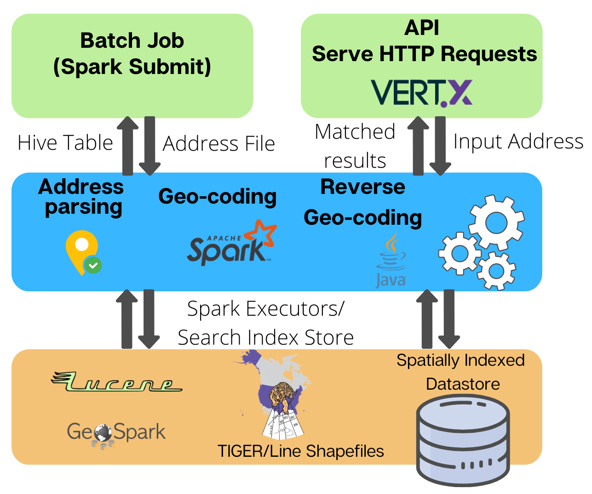

# LocationTools: Geocoding Large Datasets

<p align="left">
  &nbsp;&nbsp;&nbsp;&nbsp;&nbsp;&nbsp;&nbsp;&nbsp;
  &nbsp;&nbsp;&nbsp;&nbsp;&nbsp;&nbsp;&nbsp;&nbsp;
  &nbsp;&nbsp;&nbsp;&nbsp;&nbsp;&nbsp;&nbsp;&nbsp;
  &nbsp;&nbsp;&nbsp;&nbsp;&nbsp;&nbsp;&nbsp;&nbsp;
</p>

LocationTools is an open source platform developed under the direction of data scientists National Fire Protection Association (NFPA) to effeciently geocode very large amounts of data.  To do bulk geolocation quickly, LocationTools makes use of a suite of technologies such as Spark, Lucene, and Libpostal to conduct geocoding on a Cloudera Hadoop network. LocationTools also provides a more easily managed web API for single address geocoding that a user can easily implement using Docker.  Finally, LocationTools uses U.S. Census TIGER files as its base layer of street address location data.  To learn how to use LocationTools on your machine or cluster, please read the below information or visit the project webpage at https://nfpa.github.io/LocationTools. 

We're looking for partners to help maintain and grow LocationTools.  If you're interested, please reach out to us at XXX@XXXX.

## Motivation
Geocoding millions of address points is painful, time consuming, and often a very expensive process. That, however, is the problem NFPA encountered with geocoding fire department response information from NFIRS ( [National Fire Incident Reporting System](https://www.usfa.fema.gov/data/nfirs/index.html) ), a data set dissemenated by annually the United States Fire Adminstration (USFA) containing information 20,000+ fire departments across the United States. A single year of  NFIRS data contains records of 20-25 million fire incidents. While individaul fire departments often collect and store geolocation data for the incidents that they respond to, the public data provdided by USFA only contains street addresses for those incidents.  Complicating matters, those street addresses are often only partially filled out, leaving us with a very large amount of very messy data.

We quickly discovered that standard approaches to geocoding, either through commercial services or existing open source platforms, couldn't produce results that were accurate, fast, and cost-effective for the NFIRS data,  So we launched this project, codenamed 'Wandering Moose', to solve some aspects of spatial analysis on huge datasets for downstream spatial analysis.  Trade-offs, though, are inevitable, and focused on speed and cost at the cost of a bit accuracy.  We made this tradeoff since our use cases didn't require roof-top accuracy, and being "close enough" was "good enough" for what we wanted.   

Whlie this tool is initially geared towards NFIRS type dataset, we presume that it can be extended to any dataset with address fields. We provide you with sufficient documentation related to how it can be setup in different ways (<a href="#api-webserver">WebServer</a> or <a href="#docker-setup">Docker</a>) with code, examples, and sample result outputs. <a href="#getting-started">See the Getting Started section below for more information.</a>

## Methodological Approach

Open source tools such as POSTGIS do support geocoding, but there is sufficient execution bottleneck due to limited distribution capabilities. Therefore, geocoding millions of records becomes painful and time-consuming. We wanted to scale this processing on multiple machines with multiple cores to achieve maximum throughput with least amount of latency.

[TIGER/Line Database](https://www.census.gov/programs-surveys/geography/technical-documentation/complete-technical-documentation/tiger-geo-line.html) is an extensive collection of geographic and cartographic information of United States from the US Census Bureau. The shapefile includes polygon boundaries of geographic areas and features, linear features including roads and hydrography, and point features. They do not contain any sensitive data.

We created a JAVA based wrapper to download specific version and layers from Line Shapefiles, [GeoSpark](https://datasystemslab.github.io/GeoSpark/) utilities convert all Shapefiles as DataFrames and join specific attribute types (like Faces, Edges etc.) into one huge CSV file for indexing (Query used for joining is provided in project's resource folder).

For indexing, [Apache Lucene](https://lucene.apache.org/) and [JTS Topology Suite](https://locationtech.github.io/jts/) is used for non-GIS and GIS related fields respectively. Lucence’s Spatial package contains different Spatial Strategies to create and index spatial data, we have used [SpatialPrefixTrees](https://lucene.apache.org/core/7_4_0/spatial-extras/org/apache/lucene/spatial/prefix/tree/SpatialPrefixTree.html) that decomposes geographic shapes into variable length strings with precision. Each string corresponds to a rectangular spatial region. This is also referred to as “Grid” or “Tiles”. Each line in the above CSV is converted to a Lucene document to be indexed. Size of the index also depends on the precision of geohash used for constructing the grid.

For geocoding (searching the index), we added two ways of doing it either with single address, or a batch of addresses. For both, Jpostal is used to parse and normalize the input address into multiple components (House No., Street Name, State, ZIP etc.) It constructs the Composite Query based on quality of the parsed components from Jpostal. Searching single address just prints the reusults to standard output. Batch geocoding uses a [Spark RDD](https://spark.apache.org/docs/latest/rdd-programming-guide.html) utilities to map the input batch DataFrames as partitions, parallelize execution and perform fast in-memory searching. We created a GeocodeWrapper that maps raw output of geocoder into multiple output formats like JSON, String or ScalaMap for Hive. We used ScalaMap to directly create HIVE output table for batch geocoding (All resources are in the Utils folder).

For Reverse Geocoding, we use the same Spatial Strategies mentioned above to convert the LAT, LON to point in KM and find all results within specified distance sorted by closest to farthest.

All results were benchmarked with CDH cluster with about 224 cores capacity (7 Datanodes 32cores each). About 25 Million records take 12-14hrs which was significantly better than POSTGIS time which took weeks.

<p align="left"><br><i>Figure 1.0 - Geocoding Architecture</i></br></p>

## Built With

* [IntelliJ Idea](https://www.jetbrains.com/idea/) - JAVA IDE for code development
* [Maven](https://maven.apache.org/) - Dependency Management
* [Lucene](https://lucene.apache.org/core/8_2_0/) - For Indexing and searching geo-spatial data
* [libpostal](https://github.com/openvenues/libpostal) - NLP based address processing/normalization engine
* [US Census Shapefiles](https://www.census.gov/programs-surveys/geography/technical-documentation/complete-technical-documentation/tiger-geo-line.2018.html) - Shapefiles (2018) used for indexing
* [GeoSpark](https://github.com/DataSystemsLab/GeoSpark) - for Spark based geo-processing
* [Vert.x](https://vertx.io/) - For Simple API Deployment
* [CDH](https://docs.cloudera.com/documentation/enterprise/6/6.3/topics/installation.html) - For Cluster Deployment
* [Docker](https://www.docker.com/) - For container based Deployment

## [Getting Started](#getting-started)

These instructions will get you a copy of the project up and running on your local machine for development and testing purposes.
You can run the project either by spinning up an API service (locahost:8080) which will geocode addresses sequentially or run in batch mode using Spark-on-YARN service using CDH cluster. Both of these runtimes require you to have: 
1) <a href="#building-the-jar">JAR file built</a> from the project codebase
2) Location to <a href="#build-lucene-index">Lucene Indexes</a>
3) Address Parsing <a href="#prerequisites">libraries</a>
4) <a href="#create-configurations-file">Configuration files</a> to control geocoding parameters (`driver.ini` for batch mode and `vertx-conf.json` for API mode)

The setup is tried and tested only on Linux/Ubuntu 16.04, for Windows the preferred way would be to use the <a href="#docker-setup">docker setup.</a>.

#### [Prerequisites](#prerequisites)

  - Install libpostal from [here](https://github.com/openvenues/libpostal#installation-maclinux)
  - Install Java bindings(jpostal) to libpostal from [here](https://github.com/openvenues/jpostal#building-jpostal)
    Shared libraries will be available at `jpostal/src/main/jniLibs`. This location will be used in the driver configuration later.
  - Intall git(>=2.17) & maven(>=3.6.0)

  ```bash
  sudo apt-get update
  sudo apt-get install git maven
  ```

#### [Building the JAR](#building-the-jar)

  ```
  git clone https://github.com/NFPA/LocationTools.git
  sudo mvn clean install
  ```

  This generates JAR named `location-tools-1.0-SNAPSHOT.jar` in your `target` directory.

#### [Create Configurations File](#create-configurations-file)

  See sample configuration files `drivier.ini` and `vertx-conf.json` in project root folder.

  The `driver.ini` configuration file serves multiple purposes
  1) Params for Downloading, indexing TIGER Census data and creating lucene indexes (see section `download`, `process` and `index`)
  2) Params for geocoding single address and multiple files (see section `geocode`, `batch-geocode`)
  3) Params for simple reverse geocoding. (see section `reverse-geocode`)

  > [ **Note: Make sure that \*.dir paths end in / except input.dir which can be regular expression** ]

  The `vertx-conf.json` contains params for the webserver. 


#### [Build Lucene Index](#build-lucene-index)

  [ **Note: Make sure you have about ~30G for complete US build** ]

    # Download the TIGER data:
    # We use TIGER2018 data pulished by United States Census Bureau. TIGER data is in shape file format. We first download the zip files from census website. You can specify which states to download in the `driver.ini` file by changing the states key in [download] section. You can specify a comma separated list of US state codes.

    ```java
    java -cp /usr/src/location-tools-1.0-SNAPSHOT.jar org.nfpa.spatial.Driver --download driver.ini
    ```

    # Preprocess the data for indexing:
    # For lucene to consume the downloaded data, we first convert the downloaded shape files to csv and combine information from multiple file types like FACES, EDGES, STATE, COUNTY using GeoSpark functionality.
    
    ```java
    java -cp /usr/src/location-tools-1.0-SNAPSHOT.jar org.nfpa.spatial.Driver --process driver.ini
    ```

    # Build Lucene Indexes:
    # We can now index all the csv files into lucene.
    ```java
    java -cp /usr/src/location-tools-1.0-SNAPSHOT.jar org.nfpa.spatial.Driver --index driver.ini
    ```
    
    # You should now have files in the `lucene.index.dir` directory.
    # It's always a good idea to check the index with Lucene Luke which you can find in [lucene binary releases](https://lucene.apache.org/core/downloads.html) (Lucene >= 8.1)

    # Test Single address:
    ```java
    java -cp target/location-tools-1.0-SNAPSHOT.jar org.nfpa.spatial.Driver --geocode driver.ini
    ```

    # Test Reverse geocode single address:
    ```java
    java -cp target/location-tools-1.0-SNAPSHOT.jar org.nfpa.spatial.Driver --reverse-geocode driver.ini
    ```

## Deployment
Now that you have the JAR file, location for address parsers(jpostal) and location for generated lucene indexes. The app can be deployed using a simple JAVA <a href="#api-webserver">API webserver</a> using vertx or batch mode using a <a href="#spark-cluster-mode">cluster setup.</a>

#### [API WebServer](#api-webserver)
  
  Starting the web server with below command creates two endpoints 
  `/geocoder/v1` - geocoding which can take two arguments `address` and `n` number of results
  `/reverse-geocoder/v1` - geocoding which takes arguments `lat`,`lon`,`n` and `radius`
  
  ```java
  java -Dvertx.options.blockedThreadCheckInterval=9999 \
      -Djava.library.path="/path/to/jniLibs" \
      -jar /path/to/location-tools-1.0-SNAPSHOT.jar \
      -conf vertx-conf.json
  ```
  
  Edit `vertx-conf.json` file to run on different host and port.
  
  **Testing geocoding endpoint:**
  
  ```curl
  curl http://localhost:8080/geocoder/v1?n=1&address=1%20Batterymarch%20Park%20Quincy%20MA
  ```
  Respose:
  ```json
  {
    "version": "1.0",
    "input": "1 Batterymarch Park Quincy MA",
    "results": [
        {
            "ADDRESS_SCORE": "60.0",
            "BLKGRPCE": "1",
            "BLKGRPCE10": "1",
            "BLOCKCE10": "1022",
            "COUNTY": "Norfolk",
            "COUNTYFP": "021",
            "FULLNAME": "Batterymarch Park",
            "GEOMETRY": "LINESTRING (-71.02700999999999 42.23033999999999, -71.02670999999998 42.230299999999986, -71.02660999999999 42.23028)",
            "INTPTLAT": "42.23122024536133",
            "INTPTLON": "-71.02692413330078",
            "LFROMADD": "1",
            "LINT_LAT": "42.23033893043786",
            "LINT_LON": "-71.027001978284",
            "LTOADD": "99",
            "NAME": "Massachusetts",
            "PLACE": "Quincy",
            "RFROMADD": "",
            "RTOADD": "",
            "SEARCH_SCORE": "57.5",
            "STATEFP": "25",
            "STUSPS": "MA",
            "SUFFIX1CE": "",
            "TRACTCE": "418003",
            "UACE10": "09271",
            "ZCTA5CE10": "02169",
            "ZIPL": "02169",
            "ZIPR": "",
            "ip_postal_city": "quincy",
            "ip_postal_house_number": "1",
            "ip_postal_road": "batterymarch park",
            "ip_postal_state": "ma"
        }
    ]
}
  ```
  
  **Testing Reverse geocoding endpoint:** 
  
  ```curl
  curl http://localhost:8080/reverse-geocoder/v1?lat=42.2303&lon=-71.0269&radius=0.01&n=1
  ```
  
  Response:
  ```json
  {
    "version": "1.0",
    "input": "42.2303, -71.0269",
    "results": [
        {
            "BLKGRPCE": "1",
            "BLKGRPCE10": "1",
            "BLOCKCE10": "1022",
            "COUNTY": "Norfolk",
            "COUNTYFP": "021",
            "FULLNAME": "Batterymarch Park",
            "GEOMETRY": "LINESTRING (-71.02700999999999 42.23033999999999, -71.02670999999998 42.230299999999986, -71.02660999999999 42.23028)",
            "INTPTLAT": "42.23122024536133",
            "INTPTLON": "-71.02692413330078",
            "LFROMADD": "1",
            "LTOADD": "99",
            "NAME": "Massachusetts",
            "PLACE": "Quincy",
            "RFROMADD": "",
            "RTOADD": "",
            "STATEFP": "25",
            "STUSPS": "MA",
            "SUFFIX1CE": "",
            "TRACTCE": "418003",
            "UACE10": "09271",
            "ZCTA5CE10": "02169",
            "ZIPL": "02169",
            "ZIPR": ""
        }
    ]
}
  ```

#### [Spark Cluster mode](#spark-cluster-mode) 

 Our assumption is you have already setup a CDH cluster with SparkOnYARN enabled. Please see Cloudera documentation how to [Run Spark application on YARN](https://docs.cloudera.com/documentation/enterprise/5-13-x/topics/cdh_ig_running_spark_on_yarn.html) 
  
  > Note: In order to run the Spark Application, all the nodes in the cluster needs to have the previously built lucene index at the same path. This path is then set for lucene.index.dir key in the [batch-geocode] section of driver.ini
  
  > In addition to lucene index, all the nodes in the cluster need to have libpostal installed and must have the jpostal java bindings from `jpostal/src/main/jniLibs` after compilation. The jniLibs path is passed as config to `spark2-submit` as `--conf spark.driver.extraLibraryPath=/path/to/jniLibs`.
  
  The format of input files should be tsv (tab separated values), first column is taken as `address` and second as `join_key`.
  
  This application outputs data directly to hive. You need to change the `hive.output.table` for each run or else the spark application will fail with `AnalysisException: Table already exists`
  
  ```java
  spark2-submit --master yarn \
                --deploy-mode cluster \
                --class "org.nfpa.spatial.Driver" \
                --num-executors 80 \
                --executor-memory 18G \
                --executor-cores 2 \
                --files=driver.ini \
                --conf "spark.storage.memoryFraction=1" \
                --conf "spark.yarn.executor.memoryOverhead=2048" \
                --conf spark.executor.extraLibraryPath=/path/to/jniLibs \
                --conf spark.driver.extraLibraryPath=/path/to/jniLibs \
                path/to/location-tools-1.0-SNAPSHOT.jar --batch-geocode driver.ini
  ```
  
  > You should run spark2-submit in either headless mode or in tmux session, since batch jobs may take several hours to execute.

#### Tuning Spark Application

  [Tuning Spark Applications](https://docs.cloudera.com/documentation/enterprise/5-13-x/topics/admin_spark_tuning1.html)

## [Docker Setup](#docker-setup)
  
  #### [Build your own docker image](#build-your-own-docker-image)
   
  > Docker needs ~3 GB disk space to download libpostal data. We provide a pre-build lucence index for Masschusetts and all US Census Shapefile Data which is stored in S3. Provision sufficient space ~10GB for all states lucene index(unzipped). 
  
  ##### [Sample build using one state](#sample-build-using-one-state) 
  (Massachusetts)

  ```bash
    git clone https://github.com/NFPA/LocationTools.git
    cd LocationTools
    mvn clean install
    docker image build -t nfpa-location-tools .
    docker container run -p 8080:8080 nfpa-location-tools
  ```
  These steps will automate most of the setup and run API webserver on port 8080. You can refer Dockerfile in project folder for more details. As you see it uses `build_libpostal.sh`, `build_jpostal.sh`, `onstart-docker.sh` and `vertx-docker-conf.json` scripts.

   Refer <a href="#api-webserver">API WebServer</a> section on how to query the endpoints. 


  ##### [US build](#us-build)

  To run the US build edit the `onstart-docker.sh` file and change `BUILD` variable to `all` instead of `sample` and then run the below commands again:

  ```bash
  docker image build -t nfpa-location-tools .
  docker container run -p 8080:8080 nfpa-location-tools
  ```
  Refer <a href="#api-webserver">API WebServer</a> section on how to query the endpoints.
  
  ##### [Exporting Docker Image](#exporting-docker-image)

  You can export the image as tar file using the below command

  ```bash
    docker save -o nfpa-location-tools.tar nfpa-location-tools:latest
  ```
  
  #### [Running with Pre-built docker image](#running-with-pre-built-docker-image)
  See <a href="#build-your-own-docker-image">Build your own docker</a> section to generate a pre-built docker image
  
  Load and run the image file 
  
  ```bash
    docker load --input nfpa-location-tools.tar
    docker container run -p 8080:8080 nfpa-location-tools:latest
  ```

## Additional Documentation

  For additional documentation please check out https://nfpa.github.io/LocationTools

## Key Players

  * **Rahul Pande** - A [WPI](https://www.linkedin.com/in/pande-rahul/) data science graduate student who worked as intern at NFPA.
  * **Jason Yates** - A developer at [Clairvoyant](https://clairvoyantsoft.com/) who helped get the project off the ground.
  * **Mohammed Ayub** - [NFPA](https://nfpa.org/)
  * **Joe Gochal** - [NFPA](https://nfpa.org/)
  
  See also the list of [contributors](https://github.com/your/project/contributors) who participated in this project.

## Acknowledgments

  * [Clairvoyant](https://clairvoyantsoft.com/) - Shekhar Vemuri, Jason Yates, and team for their help in framing initial versions of the project.
  * [Cloudera](https://www.cloudera.com/) Team for their support.
  * [NFPA Data Analytics](https://www.nfpa.org/News-and-Research/Data-research-and-tools/Data-solutions) Team for testing and providing feedback

## License

  This project is licensed under the MIT License - see the [LICENSE](LICENSE) file for details
